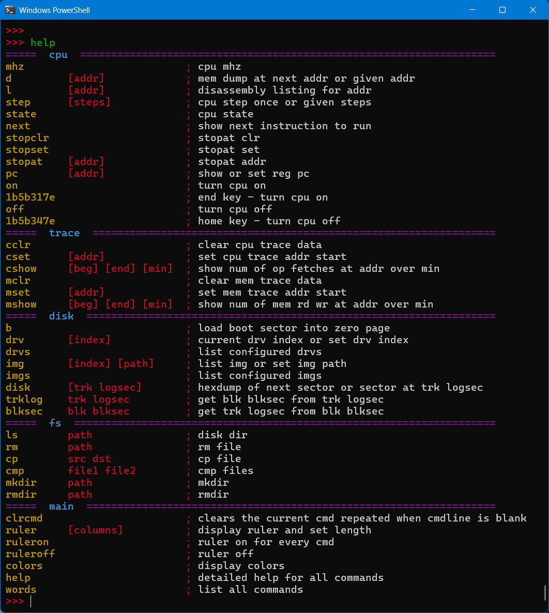
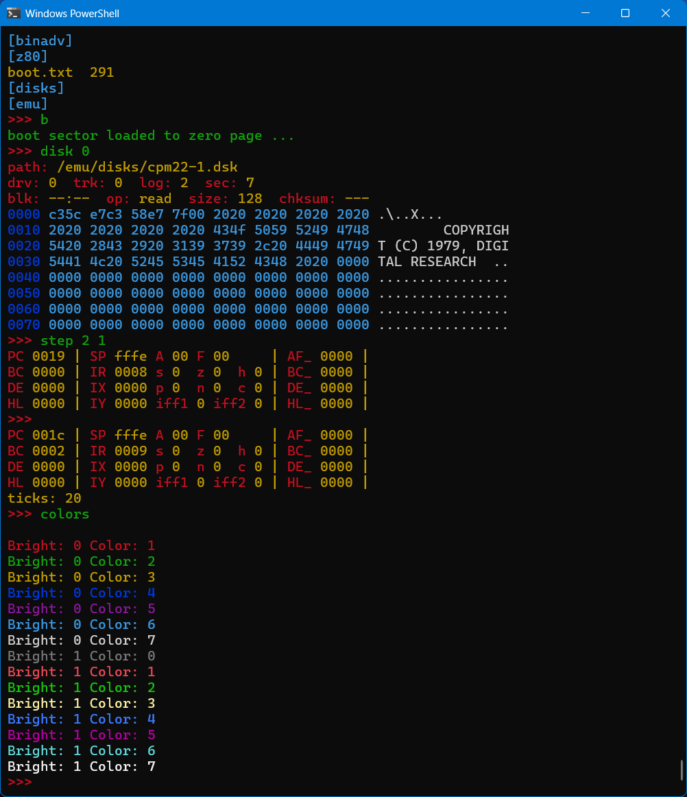
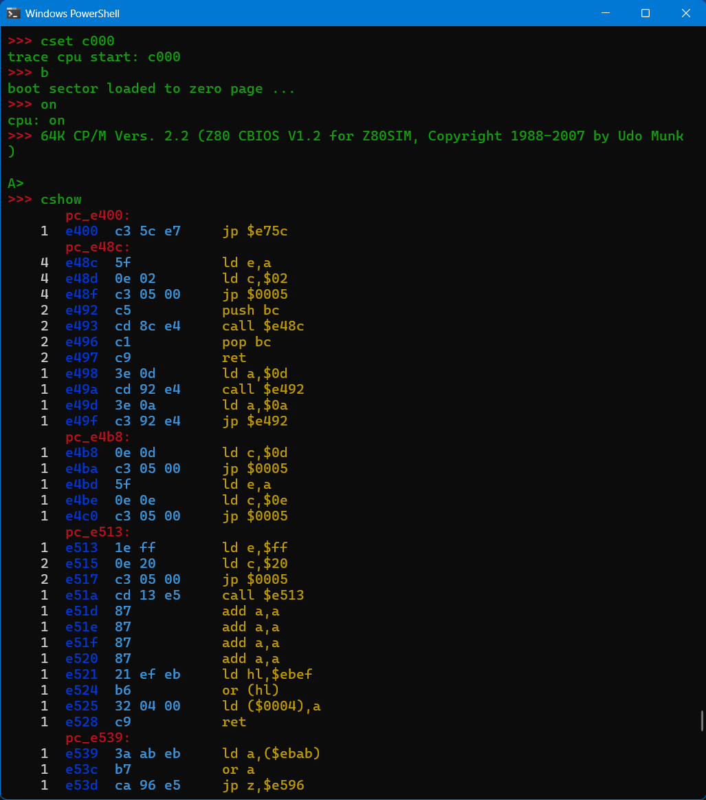

# Currently CP/M emulator running on the M5Cardputer

### Version 0.2.2 - Uploaded 2026/05/16

Binary can be found in this folder /src/emu-esp32/bin.  It is also available in M5Burner, search for CP/M Emu System.

## Requirements

I have done a small amount of testing of this on both the M5Cardputer and the M5Cardputer ADV.  I have also tested in running with via the M5Launcher and it appears to work.

In order to run CP/M, it will need the /emu folder at the root of this repository, in the root of the SDcard in the M5Cardputer.

CP/M is only usable via a USB serial terminal.  The screen on the M5Cardputer is just too small to be practical for a CP/M terminal.  The display currently just displaces a green dot for disk read activity and a red dot for write activity.  Plus you can enter commands to be sent to the command line interface of this emulator system, the output will however only display on the serial terminal.  It does not currently pass commands to CP/M.  This is more a novelty at the moment.

Any interactive ansi terminal program should work.  The Arduino IDE serial monitor will not work well with this as it lacks the interactivity and the ansi abilities.  I have included a small terminal in the root of this repository under the term folder.  It is written in nodeJS, so it can be run using the command "node term [port] [baudrate]".  It will require the "serialport" module for nodeJS installed, "npm install serialport".  I created this term program as it will auto reconnect to the com port if it disconnects, which is useful when developing.  For example, if I wish to reset the M5Cardputer, the port will reconnect, unlike other terms like Putty.



## Limitations

I just started writing this less than 3 weeks ago, so I have yet to put a lot of effort into error checking.  For example, entering commands that use parameters outside the limits may result in unpredictable results, maybe even a crash.  For instance, the memory address should always be in the range of 0000 to ffff, in some cases I have checks in place.  The configuration is also currently hardcoded into the source code.  Eventually, I hope to put the configuration in a config file to avoid having to rebuild the app everytime I want to change the configuration.

The design and cmd names may change in the future.  As to how much time I spend on enhancing this in the near future is hard to say, especially as it is now approaching summer.

## History

The code here is meant to be much more general in the future.  I choose this platform for the initial development as it uses a somewhat resource limited microprocessor, but at the same time, has a number of interesting hardware features such as the screen and keyboard.

This is part of my effort to improve some quick and dirty code I wrote a while back.  It started out as a basic command driven interface to run some commands to examine some disk images, initially TRS-80, but I decided to start with the much more documented CP/M disk images.  Then somehow, I ended up adding in a Z80 cpu emulator and ended up with a basic CP/M emulator running under nodeJS.

As I am also interested in running code on microcontrollers, I decided to rewrite this code in C, as a way to both update my C skills and redesign the structure of the code.  I decided to try and use as much non-C++ C code as possible as it can be more memory efficient, especially with string management.  I wrote a lot of C back over 35 years ago, but I have only recently began using C and C++ in the Arduino platform.

## Status

I am particularly happy with the new design for how the command line interface.  It keeps the code fairly easy to read, makes it convenient for providing a basic list of commands and also a basic help for each one.  As the command table and the additional help is in the same table, there is guaranteed to be a list of all commands, even if the short arg list and help strings are not initially set.

So far, I added most of the essential commands from my nodeJS version.  I have also gotten the emulator running using a third party Z80 cpu emulator written in C.  I have been mostly focused on the command line interface, so the emulation side does not have much in the way of error checking.

Note: I am running this with the M5Cardputer connected to a serial terminal over the USB connection.  I am not currently using the M5Cardputer's screen or keyboard, that will be in the future.

And it even has some color when used with an ansi color terminal.



## Bugs and Issues

I ran into a bug that caused a crash due to a variable that acts as an index representing the drive the command shell is currently working with.  This variable is not related to the drive that is currently configured within CP/M.  However, there was an issue whereby when I connected keyboard IO to the CP/M system and then went back to the command line monitor, this variable, drv, had somehow been corrupted.  I moved the location of the variable from emu.h to emu.state.h as that was where I intend it to be located.  The issue went away, but I still hope to move the variable back temporarily to try and find out why this was happening.

## Sample Images

Example of a cpu trace session.  The first command, cset c000 is used to set the trace start memory address.  This is required as the limited memory on the microcontroller does not allow tracking cpu and memory requests across the full 64k.  It is therefore limited to 16k only, so c000 was choosen at is covers all the cpm os core.  The boot sector is then loaded, the cpu started and we can then view the cpu trace data.

The red colored labels are auto generated whenever the data address jumps farther than the previous instruction length.  It has not smarts, so it will miss most addresses, but it does help a bit to split the info up into sections.



## Running It

The emu folder in this director needs to be placed on the SDcard in the M5Cardputer.  It currently has 4 CP/M disk images.  The CP/M ones are from the Z80pack github project with a few files added.

Then the arduino project needs to be built and loaded into the M5Cardputer.  Note: I haven't yet tested if this will run with the M5Launcher yet, as it is far quicker to develop it without the launcher.  I also only tested it on the M5Cardputer Adv.

At this point, a terminal app is required, such as Putty.  The serial monitor in the Arduino IDE has limited ability to work interactively.  Note: In order to connect another terminal, the serial monitor must not be connected.  Also, when loading the sketch from the Arduino IDE, the terminal program needs to be disconnected.

## Some useful commands to run at the >>> prompt

Note:  The PageUp key connects the keyboard to CP/M.  PageDown connects the keyboard to the monitor command line.  When used, it will display a message that the IO was redirected.  The Star Trek that I ran is a modified version I created that allows it to be run on a screen with only 60 columns.  I did this as I initially wrote this emulation on my phone in javascript, so I could run it under nodeJS in Termux, took about 5 weeks for the initial nodeJS version.  This version does have a fair amount of additional functionality, but it was not well planned out, so the code is not as ideally organized as I would like.  Yes, I was crazy enough to write the first 5000 lines of javascript using the phones touch keyboard.  I am currently using a real keyboard and a large screen.

```
>>> help
---------- main    ------------------------------------------------------------
colors                       ; display colors
help                         ; detailed help for all commands
words                        ; list all commands
---------- cpu     ------------------------------------------------------------
mhz                          ; cpu mhz
d           [addr]           ; mem dump at next addr or given addr
step        [steps]          ; cpu step once or given steps
pc          [addr]           ; show or set reg pc
on                           ; turn cpu on
1b5b317e                     ; end key - turn cpu on
off                          ; turn cpu off
1b5b347e                     ; home key - turn cpu off
---------- disk    ------------------------------------------------------------
b                            ; load boot sector into zero page
drv         [index]          ; current drv index or set drv index
drvs                         ; list configured drvs
img         [index] [path]   ; list img or set img path
imgs                         ; list configured imgs
disk        [trk logsec]     ; hexdump of next sector or sector at trk logsec
trklog      trk logsec       ; get blk blksec from trk logsec
blksec      blk blksec       ; get trk logsec from blk blksec
---------- fs      ------------------------------------------------------------
ls          path             ; disk dir
rm          path             ; rm file
cp          src dst          ; cp file
cmp         file1 file2      ; cmp files
mkdir       path             ; mkdir
rmdir       path             ; rmdir
>>> ls /emu/disks
cpm22-2.dsk  256256
trek.cpm  256256
8080tools.cpm  256256
cpm22-1.dsk  256256
>>> drvs
drv: 0 img: 0 path: /emu/disks/cpm22-1.dsk
drv: 1 img: 1 path: /emu/disks/cpm22-2.dsk
drv: 2 img: 2 path: /emu/disks/8080tools.cpm
drv: 3 img: 3 path: /emu/disks/trek.cpm
drv: 4 img: 4 path:
drv: 5 img: 5 path:
drv: 6 img: 6 path:
drv: 7 img: 7 path:
drv: 8 img: 8 path:
drv: 9 img: 9 path:
>>> drv
drv: 0
>>> disk 0 1
path: /emu/disks/cpm22-1.dsk
drv: 0  trk: 0  log: 1  sec: 1
blk: --:--  op: read  size: 128  chksum: ---
0000 c319 0042 4f4f 543a 2065 7272 6f72 2062 ...BOOT: error b
0010 6f6f 7469 6e67 0d0a 0001 0200 1632 2100 ooting.......2!.
0020 e43e 00d3 0a78 d30b 79d3 0c7d d30f 7cd3 .>...x..y..}..|.
0030 10af d30d db0e b7ca 4a00 2103 007e b7ca ........J.!..~..
0040 4800 d301 23c3 3d00 f376 15ca 00fa 3180 H...#.=..v....1.
0050 0039 0c79 fe1b da25 000e 0104 c325 0000 .9.y...%.....%..
0060 0000 0000 0000 0000 0000 0000 0000 0000 ................
0070 0000 0000 0000 0000 0000 0000 0000 0000 ................
>>> on
cpu: on
>>> 64K CP/M Vers. 2.2 (Z80 CBIOS V1.2 for Z80SIM, Copyright 1988-2007 by Udo Munk)

A>io directed to cpu ...

A>dir
A: DUMP     COM : SDIR     COM : SUBMIT   COM : ED       COM
A: STAT     COM : BYE      COM : RMAC     COM : CREF80   COM
A: LINK     COM : L80      COM : M80      COM : SID      COM
A: RESET    COM : WM       HLP : ZSID     COM : MAC      COM
A: TRACE    UTL : HIST     UTL : M        ASM : LIB80    COM
A: WM       COM : HIST     COM : DDT      COM : Z80ASM   COM
A: CLS      COM : SLRNK    COM : MOVCPM   COM : ASM      COM
A: LOAD     COM : XSUB     COM : LIB      COM : PIP      COM
A: SYSGEN   COM : M        PRN : M        HEX : M        COM
A: T        TXT : TEST     Z80 : TEST     BAK : TEST     COM
A: TEST     LST : TTTT     COM : RUN      COM
A>d:
D>dir
D: MBASIC   COM : STARTRK  BAS : STARINS  BAS : OTHELLO  COM
D: CRC      COM : DEMO     ASM : LADDER   COM : LADDER   DAT
D: T        BAS : TREK     BAS
D>mbasic t.bas
BASIC-80 Rev. 5.21
[CP/M Version]
Copyright 1977-1981 (C) by Microsoft
Created: 28-Jul-81
34872 Bytes free


          THE USS ENTERPRISE --- NCC-1701


                            ,------*------,
            ,-------------   '---  ------'
             '-------- --'      / /
                 ,---' '-------/ /--,
                  '----------------'


 YOUR ORDERS ARE AS FOLLOWS:
 --------------------------
 DESTROY THE 19 KLINGON WARSHIPS WHICH HAVE INVADED THE
 GALAXY BEFORE THEY CAN ATTACK FEDERATION HEADQUARTERS
 ON STARDATE 2428. THIS GIVES YOU 28 DAYS. THERE ARE
 3 STARBASES IN THE GALAXY FOR RESUPPLYING YOUR SHIP.

 ARE YOU READY TO ACCEPT COMMAND? y
␦

 YOUR MISSION BEGINS WITH YOUR STARSHIP LOCATED
 IN THE GALACTIC QUADRANT, 'CAPELLA I'.

  +-1---2---3---4---5---6---7---8-+
 1|                        <E>  * |1  STARDATE   2400.0
 2|                               |2  CONDITION   GREEN
 3|     *               *         |3  QUADRANT     3, 5
 4|                 *             |4  SECTOR       1, 7
 5|                               |5  TORPEDOES      10
 6|                     *         |6  ENERGY       3000
 7|         *   *   *             |7  SHIELDS         0
 8|                               |8  KLINGONS       19
  +-1---2---3---4---5---6---7---8-+

 COMMAND? 

 ENTER ONE OF THE FOLLOWING:
 --------------------------
   NAV  (TO SET COURSE)
   SRS  (FOR SHORT RANGE SENSOR SCAN)
   LRS  (FOR LONG RANGE SENSOR SCAN)
   PHA  (TO FIRE PHASERS)
   TOR  (TO FIRE PHOTON TORPEDOES)
   SHE  (TO RAISE OR LOWER SHIELDS)
   DAM  (FOR DAMAGE CONTROL REPORTS)
   COM  (TO CALL ON LIBRARY-COMPUTER)
   XXX  (TO RESIGN YOUR COMMAND)


 COMMAND? LRS

 LONG RANGE SCAN FOR QUADRANT 3, 5

 -------------------
 | 007 | 003 | 003 |
 -------------------
 | 001 | 008 | 003 |
 -------------------
 | 308 | 001 | 005 |
 -------------------

 COMMAND? SRS

  +-1---2---3---4---5---6---7---8-+
 1|                        <E>  * |1  STARDATE   2400.0
 2|                               |2  CONDITION   GREEN
 3|     *               *         |3  QUADRANT     3, 5
 4|                 *             |4  SECTOR       1, 7
 5|                               |5  TORPEDOES      10
 6|                     *         |6  ENERGY       3000
 7|         *   *   *             |7  SHIELDS         0
 8|                               |8  KLINGONS       19
  +-1---2---3---4---5---6---7---8-+

 COMMAND? XXX

 THERE WERE 19 KLINGON BATTLE CRUISERS LEFT AT
 THE END OF YOUR MISSION.


 THE FEDERATION IS IN NEED OF A NEW STARSHIP COMMANDER
 FOR A SIMILAR MISSION -- IF THERE IS A VOLUNTEER,
 LET HIM STEP FORWARD AND ENTER 'AYE'? aye
Ok
system

D>io directed to cli ...

>>> words
[ colors help words mhz d step pc on 1b5b317e off 1b5b347e b drv drvs img imgs 
disk trklog blksec ls rm cp cmp mkdir rmdir ]
>>> pc
64449
>>> d
0000 c303 fa00 03c3 06ec 2065 7272 6f72 2062 ........ error b
0010 6f6f 7469 6e67 0d0a 0001 0200 1632 2100 ooting.......2!.
0020 e43e 00d3 0a78 d30b 79d3 0c7d d30f 7cd3 .>...x..y..}..|.
0030 10af d30d db0e b7ca 4a00 2103 007e b7ca ........J.!..~..
0040 4800 d301 23c3 3d00 f376 15ca 00fa 3180 H...#.=..v....1.
0050 0039 0c79 fe1b da25 000e 0104 0054 2020 .9.y...%.....T
0060 2020 2020 2042 4153 0000 003e 0020 2020      BAS...>.
0070 2020 2020 2020 2020 74fb 80f9 3313 b5fb         t...3...
0080 0000 0000 0000 0000 0000 0000 0000 0000 ................
0090 0000 0000 0000 0000 0000 0000 0000 0000 ................
00a0 0000 0000 0000 0000 0042 4153 0119 0016 .........BAS....
00b0 a5a6 a700 0000 0000 0000 0000 0000 0000 ................
00c0 e554 5241 4345 2020 2043 504d 0000 0080 .TRACE   CPM....
00d0 aaab acad aeaf b0b1 b2b3 b4b5 b6b7 b8b9 ................
00e0 e554 5241 4345 2020 2043 504d 015c 001e .TRACE   CPM.\..
00f0 babb bcbd 0000 0000 0000 0000 0000 0000 ................
>>> d 100
0100 c38c 5d7a 29dc 2906 44bf 119e 45ec 1463 ..]z).).D...E..c
0110 1886 3940 1918 1595 1467 1451 16e6 437d ..9@.....g.Q..C}
0120 14d1 14ee 1401 449c 160e 4589 2020 4385 ......D...E.  C.
0130 1573 4403 202b 1ec0 225d 44c9 0cc9 0cfd .sD. +.."]D.....
0140 1f94 1684 2000 0024 20ee 147c 447d 4482 .... ..$ ..|D}D.
0150 44c4 44e3 3c10 16d3 157c 221b 16f9 22c9 D.D.<....|"...".
0160 13cc 13cf 13d2 13f5 1700 0000 0058 4c7b .............XL{
0170 4cf1 4c7b 50ec 1474 4d3d 2487 2400 00b7 L.L{P..tM=$.$...
0180 5900 00ba 5817 54fe 5afd 5ad9 539b 525c Y...X.T.Z.Z.S.R\
0190 5304 5a65 58d7 597b 547a 549a 53be 5948 S.ZeX.Y{TzT.S.YH
01a0 4979 4983 497c 2880 2a67 28c0 36dd 377f IyI.I|(.*g(.6.7.
01b0 38bd 262b 3779 381c 3931 39f6 4af2 1fd1 8.&+7y8.919.J...
01c0 1dd6 4896 46a4 49e2 48f2 48b6 222b 498a ..H.F.I.H.H."+I.
01d0 4690 46cb 1d7a 29f4 2920 2a6d 2a00 0000 F.F..z).) *m*...
01e0 0000 0000 0000 0000 0000 0000 0000 0000 ................
01f0 0000 007a 517d 5180 5100 008e 5540 5658 ...zQ}Q.Q...U@VX
>>>
```


