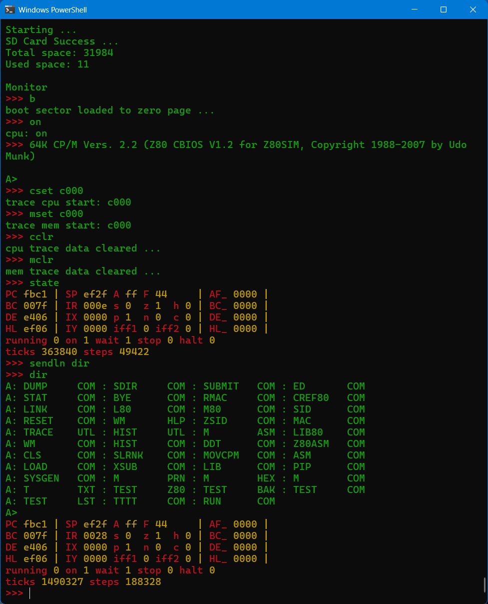
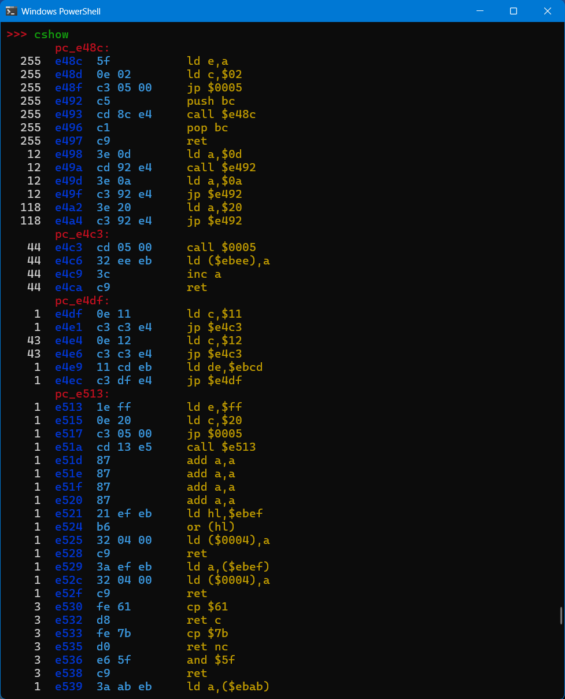
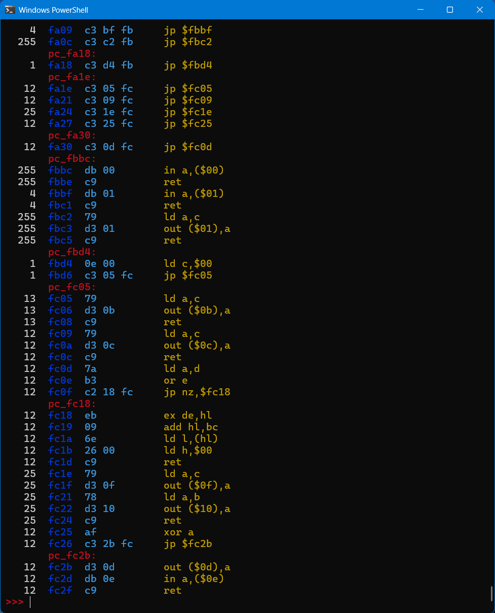

# Usage Scenerio: Learning

Goal: I am curious what code is executed when I enter DIR in CP/M.

### If not already done, clone repository and build (linux version)

```
$ git clone https://github.com/brian-sheldon/emu-sys
$ cd emu-sys/src/emu-Linux
$ make main
```

Sorry for the warnings, I plan to clean this up in the future.

### Start the emulator

```
$ ./main
Press ctrl-d to exit ...

Monitor
>>> 
```

### Load the CP/M boot sector and turn cpu on

```
>>> b
>>> on
cpu: on
>>> 64K CP/M Vers. 2.2 (Z80 CBIOS V1.2 for Z80SIM, Copyright 1988-2007 by Udo Munk)

A> <enter>
>>>
```

### Clear cpu and mem tracking data so we only see code used for DIR, show current state

```
>>> cclr
cpu trace data cleared ...
>>> mclr
mem trace data cleared ...
>>> state
PC fbc1 | SP ef2f A ff F 44     | AF_ 0000 |
BC 007f | IR 000e s 0  z 1  h 0 | BC_ 0000 |
DE e406 | IX 0000 p 1  n 0  c 0 | DE_ 0000 |
HL ef06 | IY 0000 iff1 0 iff2 0 | HL_ 0000 |
running 0 on 1 wait 1 stop 0 halt 0
ticks 363840 steps 49422
>>>
```

### Do the DIR command.  Note: We could have connected to CP/M to do this, but this is quicker

```
>>> sendln dir
A: DUMP     COM : SDIR     COM : SUBMIT   COM : ED       COM
A: STAT     COM : BYE      COM : RMAC     COM : CREF80   COM
...
A>
```

### Pressing enter will show cpu state again as it was last auto repeat cmd

```
PC fbc1 | SP ef2f A ff F 44     | AF_ 0000 |
BC 007f | IR 0028 s 0  z 1  h 0 | BC_ 0000 |
DE e406 | IX 0000 p 1  n 0  c 0 | DE_ 0000 |
HL ef06 | IY 0000 iff1 0 iff2 0 | HL_ 0000 |
running 0 on 1 wait 1 stop 0 halt 0
ticks 1490327 steps 188328
>>>>>> calc #188328 #49422 - .
Minimal C-Forth Initialized. Type code below (e.g., 2 3 + .)
138906 ok
>>>
```

Use the built in calculator to calculate the number of steps taken.  It took 138,906 cpu instructions to perform the DIR function.  Lets get some more detail.  Just shows a small sample of output with a count of how many times instruction was executed up to max of 255 and auto generated labels.  I hope to eventually add labels from CP/M source, may be a while.

```
>>> cshow
...
    1  f0a5  c9           ret
       pc_f0e2:
   12  f0e2  0c           inc c
   36  f0e3  0d           dec c
   36  f0e4  c8           ret z
   24  f0e5  7c           ld a,h
   24  f0e6  b7           or a
   24  f0e7  1f           rra
   24  f0e8  67           ld h,a
   24  f0e9  7d           ld a,l
   24  f0ea  1f           rra
   24  f0eb  6f           ld l,a
   24  f0ec  c3 e3 f0     jp $f0e3
   12  f0ef  0e 80        ld c,$80
   12  f0f1  2a b1 f9     ld hl,($f9b1)
   12  f0f4  af           xor a
  255  f0f5  86           add a,(hl)
  255  f0f6  23           inc hl
  255  f0f7  0d           dec c
  255  f0f8  c2 f5 f0     jp nz,$f0f5
   12  f0fb  c9           ret
...
```

This all looks better in color as shown.





... lots more ...




